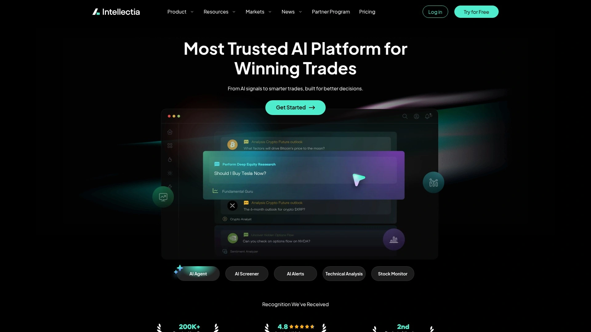

# 2025年排名前17的AI股票交易工具汇总(最新整理)

炒股这件事,说白了就是跟时间和信息量赛跑。人脑处理速度有限,情绪还会捣乱,经常该买的时候犹豫,该卖的时候贪心。现在有一批专门针对股票交易设计的AI工具,能实时分析海量数据、识别交易信号、自动执行策略。这篇文章整理了2025年市场上值得关注的AI股票交易平台,覆盖了从选股分析到算法交易的各种场景——无论你是刚入门的散户,还是需要量化回测的专业交易者,总能找到适合自己的工具。

***

## **[Intellectia.AI](https://intellectia.ai)**

AI驱动的日内交易和波段交易双模式平台

Intellectia.AI把AI选股这件事做得很直接:每天盘前给你5只股票,开盘买入,收盘卖出。他们声称通过回测验证,这套策略年化回报率超过200%。当然,回测是一回事,实盘又是另一回事,但至少说明系统在历史数据上找到了某种规律。

除了日内交易,Intellectia还提供波段交易功能。系统会生成买入、卖出、持有的信号提醒,你只需要跟着操作就行。这种模式适合没时间盯盘,但又想参与市场的上班族。界面设计得很简洁,不会用一堆复杂指标吓到新手。

定价策略比较透明,按月订阅。对于想尝试算法辅助交易、但又不想深入学编程的普通投资者来说,Intellectia提供了一个相对低门槛的入口。平台会持续更新策略,适应市场变化。

***

## **[Trade Ideas](https://www.trade-ideas.com)**

实时AI扫描引擎,专注日内交易信号

Trade Ideas在AI股票扫描这个细分领域做了很多年,核心功能是Holly AI——一个实时监控市场的交易机器人。Holly会根据你设定的参数,从数千只股票中筛选出符合条件的交易机会,并推送信号。

这个平台特别适合日内交易者。Holly能识别各种技术形态:突破、回调、动量变化等,速度快到人工根本跟不上。你可以设置自己的交易规则,比如只看成交量突然放大的股票,或者只关注特定价格区间的标的。

Trade Ideas还提供回测功能,让你验证策略在过去会有什么表现。社区功能也不错,可以看到其他交易者分享的策略设置。价格不算便宜,但对于活跃的日内交易者来说,一个好信号就能回本。

***

## **[TrendSpider](https://trendspider.com)**

自动化技术分析和多时间框架图表工具

TrendSpider把技术分析里最费时间的部分——画趋势线、找支撑阻力位、对比多个时间周期——全部自动化了。系统能在一张图表上同时叠加多个时间框架的数据,帮你看清短期波动和长期趋势的关系。

AI策略实验室是TrendSpider的核心功能,不需要写代码就能设计和测试交易策略。你设定目标和市场范围,平台用机器学习方法生成策略,然后告诉你历史回测结果。这对想学量化交易、但不会编程的人来说,是个很好的起点。

扫描器功能也很强大,除了价格走势,还能整合分析师评级、内幕交易、暗池数据等。TrendSpider主要服务股票和ETF市场,加密货币数据也支持,但指标相对少一些。适合愿意花时间深入研究的交易者。

***

## **[Tickeron](https://tickeron.com)**

AI交易机器人市场和模式识别引擎

Tickeron提供一整套AI工具:模式搜索引擎、趋势预测、实时信号、组合构建等。最有特色的是AI交易机器人市场,里面有上百个经过回测的算法策略,你可以直接使用或者在此基础上调整。

机器人分三个等级:信号代理(入门级,固定金额交易)、虚拟代理(增加资金和风险管理)、券商代理(使用真实券商数据,精确到tick级别)。时间框架支持5分钟、15分钟和60分钟。

Tickeron的图表识别功能很准,能自动标注各种K线形态和技术模式,并给出置信度评分。对于学习技术分析的新手来说,这相当于有个老师实时讲解市场在发生什么。订阅费用从免费版到专业版都有,覆盖股票、ETF、外汇和加密货币。

***

## **[QuantConnect](https://www.quantconnect.com)**

开源量化交易平台,支持C#和Python

QuantConnect是给认真做算法交易的人准备的。这是一个完全开源的云端平台,提供历史和实时市场数据,以及海量另类数据。你用C#或Python编写策略,在他们的LEAN框架上运行回测,然后连接到券商执行真实交易。

平台支持的券商包括Interactive Brokers、TradeStation、TD Ameritrade、Coinbase、Binance等。数据覆盖股票、期权、期货、外汇和加密货币。QuantConnect的优势在于云基础设施,策略可以7x24小时运行,不用担心本地服务器维护。

社区非常活跃,有超过36万算法交易者。文档详细,教程丰富,新手也能找到大量学习资源。对于日内高频交易来说,界面和订单系统稍显笨拙;但对于波段交易和中长期策略,QuantConnect是个完整的解决方案。

***

## **[Danelfin](https://danelfin.com)**

AI评分系统,预测股票未来三个月表现

Danelfin用AI处理上万个特征和900多个指标,给每只股票打1-9分,分数越高代表未来三个月跑赢市场的可能性越大。数据来源包括公司财务、估值、技术指标、新闻情绪、社交媒体等。

覆盖美股和欧洲股票,以及ETF。AI引擎每天更新分数,基于最新的市场数据和财报。免费版每天提供10只精选股票,付费版可以查看约3000只股票的评分和三个月价格目标。

Danelfin的界面很干净,没有复杂的图表和指标,就是简单直接的评分和推荐理由。适合技术派交易者,或者相信算法胜过直觉的投资者。不过要注意,这个平台纯粹依赖AI,没有人工分析师的深度研究,缺乏对公司基本面的详细解读。

***

## **[AInvest](https://www.ainvest.com)**

对话式AI投资助手,整合多券商账户

AInvest的核心是Aime——一个用自然语言对话的AI助手。你可以直接问"今天最强的加密货币信号是什么?"或者"特斯拉跟标普500比表现怎么样?",系统会给出结构化的分析。

券商连接功能很实用,能把多个券商账户汇总到一个仪表板,AI分析你的整体持仓,给出多元化建议和风险管理提示。这对同时在Robinhood、Fidelity等多个平台开户的投资者来说,省去了到处切换的麻烦。

除了对话功能,AInvest还有技术图表、AI交易信号、筛选器等工具。Magic Portfolio功能帮你优化组合配置,Magic Signal提供算法预警。支持股票、ETF和加密货币。界面友好,降低了多资产投资的学习门槛。

***

## **[Kavout](https://www.kavout.com)**

机器学习评分系统,Kai Score为核心

Kavout的特色是Kai Score——一个1到9的股票评级系统,综合技术分析和市场趋势给出预测。平台用机器学习算法处理复杂数据集,生成股票建议,同时提供组合管理和市场分析工具。

除了评分,Kavout还有基于因子的组合构建工具,支持风险分析和优化建议。回测功能让你验证策略在历史数据上的表现。股票筛选器整合了预测分析,通过实时信号提供交易想法。

定价从免费版到专业版,免费版每月20美元起。Kavout更注重投资研究而非交易执行,适合有专人负责组合管理的投资专业人士和量化分析师。对于希望数据驱动决策的中长期投资者来说,Kai Score提供了一个快速评估标的质量的参考维度。

***

## **[Magnifi](https://magnifi.com)**

对话式AI投资引擎,连接主流券商

Magnifi让你用日常语言搜索投资机会,AI会翻译你的问题,从15000多只股票和基金中找出符合你目标的标的。你可以直接通过Magnifi投资,也可以连接Fidelity、Robinhood、Schwab等券商账户。

AI会持续扫描你的投资组合,发现潜在问题:某个行业集中度过高、隐藏风险、费用过高的共同基金等。系统处理市场数据、财报和新闻,提供相关洞察帮你做决策。

订阅费用每月14美元起,按年付费更便宜。Magnifi本身不收取股票、ETF或共同基金的交易手续费,但托管账户的券商可能单独收费。适合需要AI辅助做研究、构建个性化投资计划的自主投资者。

***

## **[Composer](https://www.composer.trade)**

无代码自动化交易策略构建平台

Composer让普通投资者像对冲基金那样交易。平台上的策略叫"symphonies"(交响曲),你可以用现成的,也可以自己用可视化模块或自然语言提示词创建。每个策略都能用历史数据回测,看看过去十年会有什么表现。

有个叫Hedgefundies的基础策略,过去十年累计回报1647.9%,而标普500同期是482.2%——这是用杠杆股票和债券组合实现的。当然不是每个策略都能跑赢市场,但Composer提供的工具能帮你找到有潜力的那些。

发现页面可以按投资风格筛选策略:长期导向、特定行业(医疗、科技)、模仿传奇投资者等。你可以关注感兴趣的策略,追踪它们的表现。14天免费试用,之后按月订阅。适合想尝试算法交易、但不会编程的投资者。

***

## **[LevelFields](https://www.levelfields.ai)**

AI事件驱动交易分析平台

LevelFields专注于事件驱动的交易机会,用AI识别和分析可能影响股价的重大事件。平台监控财报、并购、监管变化、产品发布等,预测这些事件对股票和期权交易的影响。

系统会标注哪些类型的事件历史上导致了显著的价格变动,帮你提前布局。支持股票和期权交易,特别适合喜欢围绕催化剂做交易的投资者。AI处理的信息量远超个人能追踪的范围,让你不会错过关键机会。

LevelFields提供实时警报,当符合你设定条件的事件发生时立即通知。回测功能显示类似事件在过去的市场反应。适合中短期交易者,尤其是期权交易者,能利用事件带来的波动性获利。

***

## **[Streetbeat](https://streetbeat.com)**

AI驱动的自动投资顾问平台

Streetbeat用AI探索两种投资方式:行动导向(基于历史数据预测)和反应导向(分析市场实时波动)。平台的算法处理另类数据集,比如信用卡使用、社交情绪、应用使用情况,用来预测短期市场走势。

提供手动交易(股票和加密货币)和主动管理策略。财报电话会议策略会自动交易约2000只股票的季度财报行情,还有自动化的债券梯队策略和其他主题策略。所有功能集成在一个移动应用里。

Streetbeat还有个有趣的功能:学费优惠计划。用户通过各种行为(推荐朋友、付月费等)赚取积分,每个积分相当于1美元学费折扣,每年还能获得相当于管理资产10%的积分。适合想要AI辅助、但保留最终决策权的投资者。

***

## **[SignalStack](https://signalstack.com)**

无代码订单自动化工具,连接图表和券商

SignalStack是个中间层解决方案,把TradingView、TrendSpider等图表平台的警报,自动转换成券商账户的交易订单。不需要编程,平均执行时间0.45秒。

支持的券商包括Tradier、Interactive Brokers、TD Ameritrade、Alpaca、Coinbase Pro等,而且列表还在不断扩展。支持市价单、限价单等多种订单类型,覆盖股票、加密货币、期货、外汇。

定价很灵活:每月5个信号免费,50个信号27美元/月,250个信号97美元/月,1000个信号347美元/月。SignalStack解决了一个实际痛点——很多人在TradingView上有很好的策略,但手动执行太慢,这个工具让你的策略真正自动化。

***

## **[TradersPost](https://traderspost.io)**

自动化交易机器人平台,支持多资产类别

TradersPost采用"自带券商"模式,从不持有用户资金,只负责自动化交易执行。支持股票、加密货币、期权和期货,通过统一API连接TradeStation、Interactive Brokers、Coinbase、Tradovate等券商。

可以从TradingView和TrendSpider导入策略,设置回测和实时交易。界面设计得比较现代,策略管理清晰明了。定价分四档:入门版49美元/月,基础版99美元/月,专业版199美元/月(含电话支持),高级版299美元/月(全功能+优先支持)。

TradersPost的创始人说,算法交易系统历史上对散户来说既难获取又难使用,他创建这个平台就是为了让零售交易者能轻松用上自动化。适合已经有成熟策略、需要可靠执行层的交易者。

***

## **[MetaTrader 5](https://www.metatrader5.com)**

专业级算法交易平台,支持多资产和EA开发

MetaTrader 5是MetaTrader 4的升级版,功能更强大。支持更多订单类型(Fill or Kill、Immediate or Cancel等),这些是机构和算法交易经常需要的。MQL5编程语言基于C/C++,性能比MQL4更好。

MT5内置策略测试器,可以回测和优化你的Expert Advisors(EA,交易机器人)。MetaEditor提供完整的开发环境,包括调试器。编写完成后,EA可以直接在MT5平台运行,实现全自动交易。

除了自己开发,你还可以在Market购买现成的EA,或者通过Freelance服务雇人定制。MT5支持股票、期货、外汇等多个市场。平台本身免费,但需要通过支持MT5的经纪商开户。适合有编程能力、需要精确控制交易逻辑的专业交易者。

---

## **[NinjaTrader](https://ninjatrader.com)**

期货交易者首选的算法交易平台

NinjaTrader在期货算法交易领域很受欢迎,用NinjaScript(基于C#)开发交易策略。平台提供完整的策略开发、回测、优化和实盘交易流程。图表功能强大,支持多时间框架分析和自定义指标。

混合自动化交易是NinjaTrader的特色:你可以让系统自动入场,但保留人工管理出场的权利,或者完全自动化。策略可以在图表上实时显示信号,也可以直接执行交易。

NinjaTrader兼容多个期货经纪商,还支持Apex Trader Funding等prop firm账户。社区活跃,第三方开发者提供大量插件和策略。平台本身免费用于模拟交易,实盘交易需要付费许可证或通过特定经纪商开户。

***

## **[StockHero](https://www.stockhero.ai)**

面向散户的股票交易机器人

StockHero提供高评分的股票交易机器人服务,定期更新。平台简化了自动化交易的设置流程,用户不需要深入的技术背景就能上手。支持多种交易策略,从趋势跟踪到均值回归。

机器人运行在云端,不需要你保持电脑开机。可以设置风险参数、止损止盈规则,系统会按照你的要求执行。回测功能显示策略在历史数据上的表现,帮你选择合适的机器人。

StockHero定期根据市场状况更新机器人算法,确保策略适应当前环境。订阅制收费,不同套餐提供不同数量的机器人和功能。适合想要被动收入、但没有时间或技能自己编写算法的投资者。

***

## 常见问题

**AI股票交易工具能保证盈利吗?**

不能。任何声称保证盈利的工具都不可信。AI工具的价值在于处理数据速度快、能识别人工难以发现的模式、避免情绪化决策。但市场本身不可预测,历史表现不代表未来结果。这些工具更像是辅助系统——提高你的胜率和效率,但不能消除风险。使用前务必先在模拟账户测试,理解策略逻辑,设置合理的风险管理规则。

**新手应该从哪类AI工具入门?**

建议从评分和信号类工具开始,比如Danelfin或AInvest。这类平台不需要你懂编程或复杂的技术分析,AI会直接告诉你哪些股票值得关注、为什么值得关注。你可以对照自己的研究,验证AI的建议是否合理,逐步建立对工具的信任。等熟悉了市场节奏和工具逻辑,再考虑尝试自动化交易平台。切记:永远先用模拟账户练手,不要直接拿真金白银做实验。

**算法交易需要编程基础吗?**

不一定。现在很多平台提供无代码解决方案,比如Composer用可视化模块构建策略,TrendSpider的AI策略实验室用自然语言生成算法。如果你想更精确地控制交易逻辑,或者开发复杂的多因子策略,那确实需要学Python或C#。但对于大多数散户来说,无代码工具已经足够用了。重要的不是你会不会编程,而是你理不理解策略背后的市场逻辑——为什么这个信号有效?在什么市场环境下会失效?

***

## 写在最后

AI股票交易工具这个领域,技术更新很快,但核心逻辑没变:用机器处理人脑处理不了的数据量,用算法克服人性的弱点。选哪个工具主要看你的交易风格和技术水平。

如果你是刚接触算法交易的新手,想要一个简单直接的AI选股方案,**[Intellectia.AI](https://intellectia.ai)** 提供的日内和波段双模式特别适合——不需要你盯盘分析,系统给信号你跟着做就行,门槛低,上手快。对于想尝试AI辅助交易、但又不想陷入技术细节的投资者来说,这是个省心的开始。

如果你是专业交易者,需要深度定制策略,那QuantConnect或NinjaTrader这种开放平台更合适。已经在用TradingView做分析的人,加个SignalStack或TradersPost就能把信号转成实盘交易。

总之,工具是工具,赚钱还是亏钱最终取决于你对市场的理解和风险管理能力。AI可以让你跑得更快,但方向对不对,还得你自己把握。先用模拟账户验证,确认策略靠谱了,再投入真金白银——这是使用任何AI交易工具的铁律。
